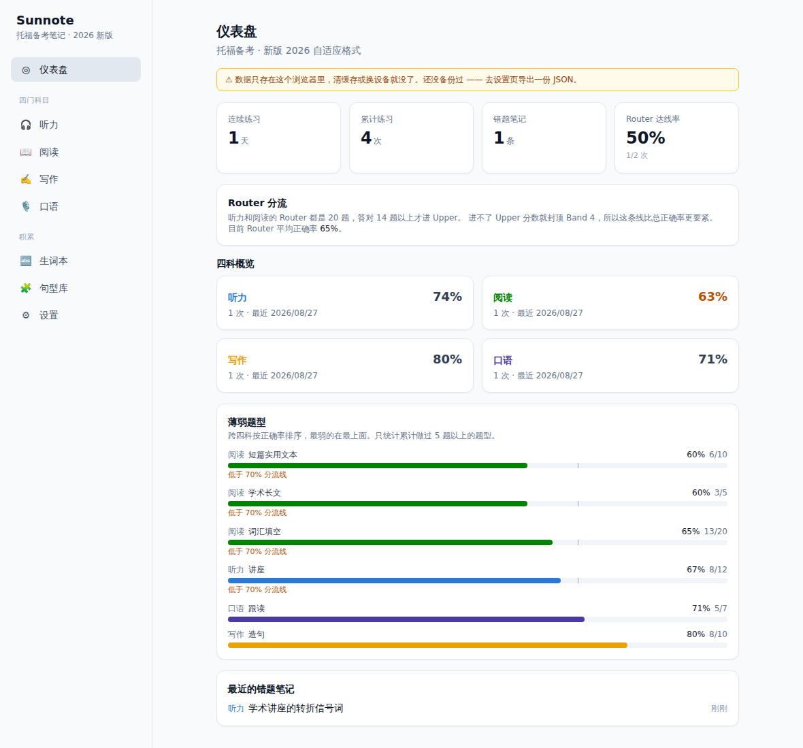

# Sunnote

托福备考笔记。按**新版 2026 自适应格式**建模——录完一套题只填「错了几个」，正确率、薄弱题型、分流达线率自动算出来。

**👉 [打开使用](https://leonsun1214.github.io/Sunnote/)** · 免费 · 无需注册 · 数据只存在你自己的浏览器里



## 它解决什么问题

刷完一套题，你知道自己错了几个，但不知道**错在哪类题上**。一个月后想不起来上次讲座题是不是也这么差。

Sunnote 让你花一分钟录完一套题，然后：

- 每个题型的正确率横着排开，**最弱的排最上面**
- 盯住 **Router 达线率**——新版考试里 Router 答对不到 14/20 就进不了 Upper，分数直接封顶 Band 4。这条线比总正确率更要紧
- 错题笔记按科目归档，做题时随手记，复习时搜得到

## 四科都按真实考试结构录入

**听力 / 阅读**：Router 20 题定分流 → 进 Upper 或 Lower 各 15 题。选好走向后，那个模块没有的题型会自动隐藏。

| 听力题型 | Router | Upper | Lower |
| --- | :-: | :-: | :-: |
| Choose a Response | 8 | 3 | 7 |
| Conversation | 4 | 4 | 4 |
| Announcement | 4 | — | 4 |
| Lecture | 4 | 8 | — |

| 阅读题型 | Router | Upper | Lower |
| --- | :-: | :-: | :-: |
| Vocabulary | 10 | 10 | 10 |
| Short Texts | 5 | — | 5 |
| Academic Passages | 5 | 5 | — |

题数是固定的，所以**只填错了几个**。没填的按全错算——这样漏填哪一块会立刻变成刺眼的低分，而不是悄悄算成满分。

**写作**：Build a Sentence 数对错；Email 和学术讨论按自评分记录，答案框实时数词并对照目标区间（130–140 / 100–130 词）。

**口语**：Listen and Repeat 七句逐句点；Take an Interview 四题各带 45 秒倒计时和转写框。

## 还有

- **生词本**——熟练度四档、随机抽查（遮住释义自己先想）
- **句型库**——语法点 / 连接词 / 写作句型 / 口语句型
- **备份**——一键导出 JSON，也能导出 Markdown 复习本拿去打印
- 深浅色主题，手机能用，装成 App 后离线也能打开

## 你的数据在哪

**只在你自己的浏览器里。** 没有服务器，没有账号，一次网络请求都不发。

代价是：**清缓存、换浏览器、换设备都会丢**。所以：

- 定期在设置页导出 JSON 备份
- 超过 7 天没导出，仪表盘会提醒你
- 换设备就把 JSON 导入过去，可以选覆盖或合并

## 本地跑

```bash
npm install
npm run dev
```

其他命令：

```bash
npm test           # 单元测试
npm run build      # 生产构建
npm run e2e        # 端到端测试（需先起 dev server 和 npx playwright install chromium）
```

推到 `main` 会自动构建并发布到 GitHub Pages。

## 关于 70% 这条线

Router 进 Upper 的门槛 ETS 没有公开，70% 是根据实例观察的估值。想按自己的数据调整，改 `src/config/subjects/listening.ts` 和 `reading.ts` 里的 `routingThreshold`，一行的事。
